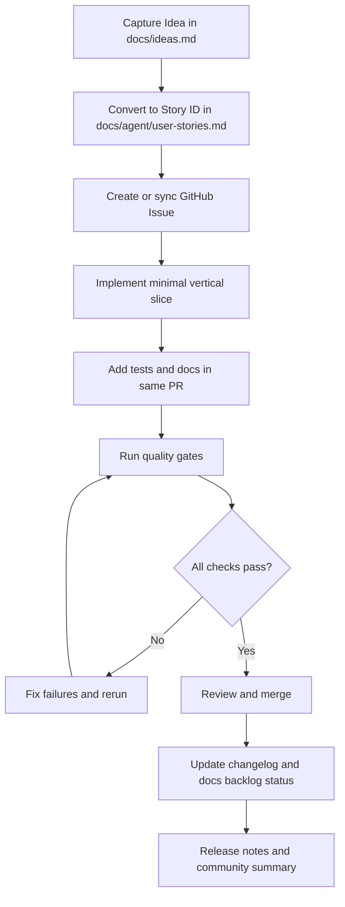
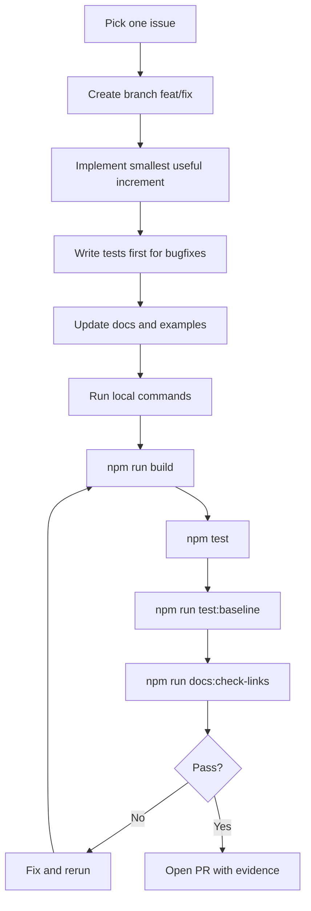
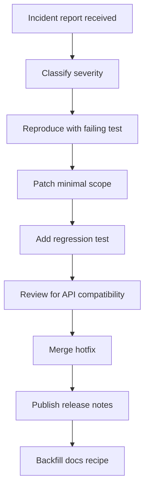
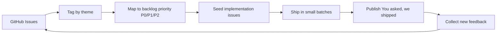
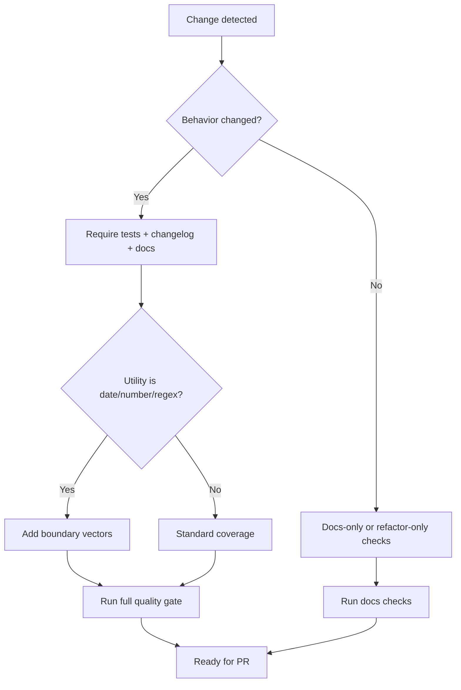
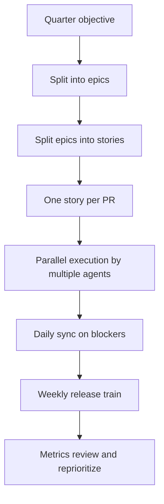

# Process Flows

All flows are implementation-oriented and optimized for autonomous agents.

## 1) Idea to Release Flow

## 2) PR Execution Flow

## 3) Incident Response Flow

## 4) Community Feedback Loop

## 5) Quality Gate Decision Tree

## 6) Agent Multi-PR Program Flow

