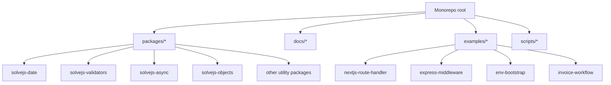
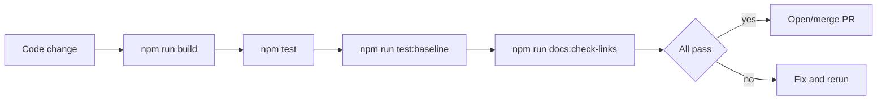
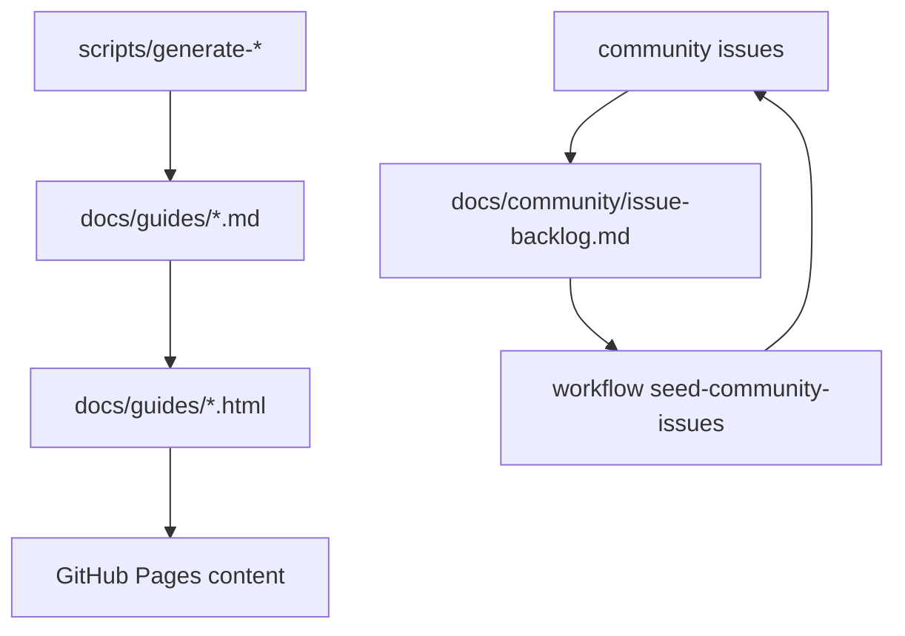

# System Design for Agent Execution

This document defines architecture and delivery surfaces agents must respect.

## Repository Delivery Architecture

## Build and Verification Pipeline

## Contracts and Boundaries

- Package contract:
  - stable exports,
  - deterministic return behavior,
  - zero runtime dependencies.
- Docs contract:
  - snippets align with real APIs,
  - links must pass checker,
  - migration guides updated when API usage changes.
- Example contract:
  - examples are runnable,
  - represent real production patterns.

## Data and Artifact Flows

## Decision Records

When agents choose a non-obvious tradeoff, record an ADR-style note in PR body:

- Context.
- Decision.
- Alternatives rejected.
- Consequences.

## Non-Functional Targets

- Correctness: no silent behavior drift.
- Simplicity: APIs should be easy to memorize.
- Maintainability: avoid speculative abstractions.
- Reliability: regression tests for every bug fix.

## Guardrails for Autonomous Changes

- Never modify multiple package public APIs in one PR.
- Never mix refactor + feature + behavior changes together.
- Never skip docs updates for externally visible changes.
- Never bypass tests to force merge velocity.
